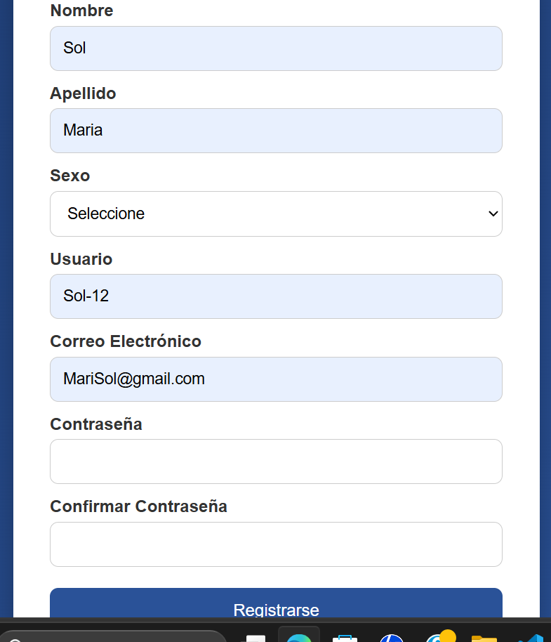
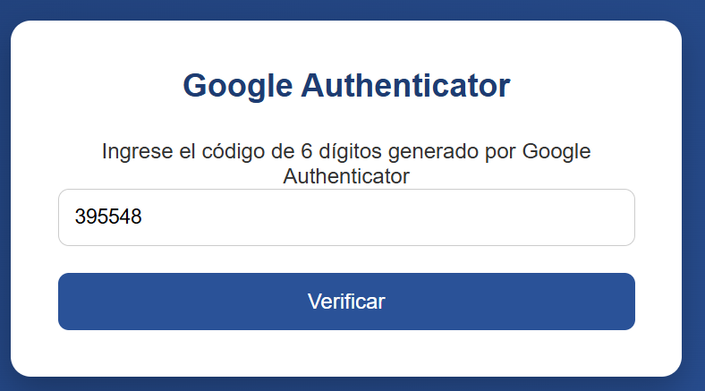
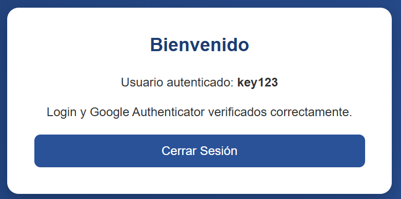
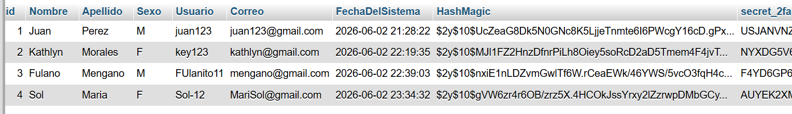
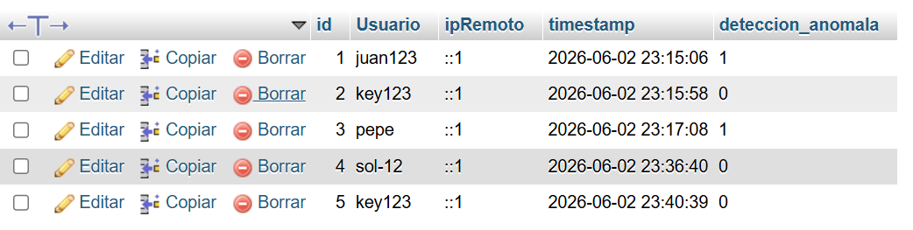
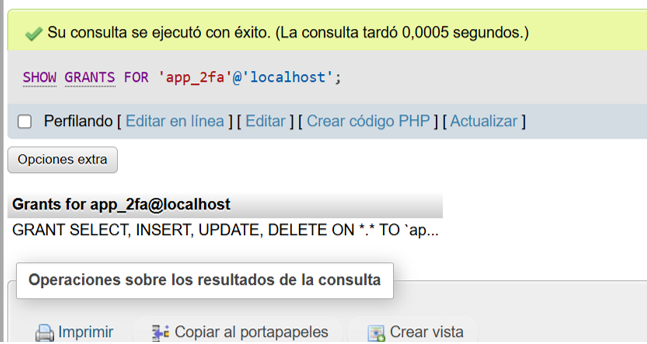

# Laboratorio - Sistema de Autenticación de Dos Factores (2FA)

## Datos del Estudiante

**Nombre:** Kathlyn Morales
**Asignatura:** Desarrollo de software VII
**Fecha:** 2 Junio 2026

---

# Descripción del Proyecto

Este proyecto consiste en el desarrollo de un sistema seguro de registro e inicio de sesión utilizando autenticación de
dos factores (2FA) mediante Google Authenticator.

El sistema permite registrar usuarios, proteger las contraseñas mediante hash, generar códigos QR para autenticación,
validar códigos temporales (TOTP), proteger formularios mediante tokens CSRF y registrar intentos de acceso para fines
de auditoría.

---

# Objetivos

## Objetivo General

Implementar un sistema de autenticación segura que combine usuario, contraseña y autenticación de dos factores utilizando
Google Authenticator

## Objetivos Específicos

* Registrar usuarios en una base de datos MySQL
* Aplicar sanitización de datos de entrada
* Proteger contraseñas mediante hash seguroo
* Implementar autenticación de dos factores 2FA
* Generar y validar códigos QR
* Aplicar protección contra ataques CSRF
* Registrar intentos de acceso al sistema
* Utilizar usuarios de base de datos con privilegios mínimos

---

# Tecnologías Utilizadas

* PHP
* MySQL
* HTML
* CSS
* Composer
* Google Authenticator
* Visual Studio Code

---

# Funcionalidades Implementadas

## Registro de Usuario

* Nombre
* Apellido
* Sexo
* Usuario
* Correo electrónico
* Contraseña

  

Validaciones implementadas:

* Campos obligatorios.
* Correo electrónico válido.
* Contraseñas coincidentes.
* Usuario no duplicado.
* Correo no duplicado.

---

## Sanitización de Datos

Se implementó la clase:

**SanitizarEntrada.php**

Métodos desarrollados:

* limpiarEspacios()
* limpiarHTML()
* quitarEtiquetas()
* convertirTitulo()

Estas funciones ayudan a evitar errores e inyecciones de código malicioso

---

## Hash de Contraseñas

Las contraseñas son protegidas utilizando:

```php
password_hash()
```

y verificadas mediante:

```php
password_verify()
```

Esto evita almacenar contraseñas en texto plano dentro de la base de datos

---

## Generación de Código QR

Durante el registro:

* Se genera un secreto único para cada usuario.
* Se almacena en la base de datos.
* Se genera un código QR compatible con Google Authenticator.

---

## Autenticación de Dos Factores (2FA)

Proceso:

1. El usuario inicia sesión.
2. Se valida usuario y contraseña.
3. Se solicita el código generado por Google Authenticator.

   
   
5. Se verifica el código temporal.
6. Se crea una segunda sesión de autenticación.
7. Se permite el acceso al área protegida.

   

---

## Protección CSRF

Se implementó un Token Anti-CSRF mediante:

```php
$_SESSION['csrf_token']
```

y

```php
random_bytes()
```

Antes de procesar el formulario se verifica que el token recibido coincida con el almacenado en la sesión

---

## Registro de Intentos de Acceso

Se implementó la tabla:

### intentos_login

Permite almacenar:

* Usuario
* Dirección IP
* Fecha y hora
* Detección de anomalías

Esto facilita la auditoría de accesos al sistema

---

# Base de Datos

## Tabla usuarios



Campos principales:

* id
* Nombre
* Apellido
* Sexo
* Usuario
* Correo
* FechaDelSistema
* HashMagic
* secret_2fa

## Tabla intentos_login



Campos principales:

* id
* usuario
* ipRemoto
* timestamp
* deteccion_anomala

---

# Usuario de Base de Datos

Se creó un usuario con permisos mínimos para acceder a la base de datos.



Privilegios otorgados:

* SELECT
* INSERT
* UPDATE
* DELETE

Comando utilizado:

```sql
SHOW GRANTS FOR 'app_2fa'@'localhost';
```

---

# Problemas Encontrados

1. Tabla intentos_login vacía

**Problema:**

Durante las pruebas finales del sistema me di cuenta que que la tabla `intentos_login` permanecía vacía, a pesar de
realizar múltiples intentos de autenticación. Esto impedía registrar adecuadamente los accesos fallidos y limitaba
el monitoreo de intentos de acceso no autorizados

**Solución:**

Se revisó el flujo de autenticación y se identificó que no se estaba ejecutando correctamente la inserción de registros
en la tabla. Se corrigió la lógica encargada de almacenar los intentos de inicio de sesión, verificando que cada acceso
fallido generara un registro con la información correspondiente

2. Organización de la Estructura del Proyecto

**Problema:**
Durante el desarrollo, la distribución de archivos dificultaba el mantenimiento y la escalabilidad de la aplicación, porque
lo tenia todo desordenado

**Solución:**
Se reorganizó el proyecto siguiendo una estructura basada en separación de responsabilidades, vistas, configuraciones y
recursos en carpetas específicas para facilitar el mantenimiento del código

## 3. Integración entre PHP y Google Authenticator

**Problema:**
Al implementar la autenticación de dos factores fue necesario generar claves secretas compatibles con Google Authenticator
y validar correctamente los códigos temporales generados por la aplicación

**Solución:**
Se integró la librería PHPGangsta/GoogleAuthenticator mediante Composer. Se configuró la generación de claves secretas 
únicas para cada usuario y se implementó la validación de códigos TOTP durante el proceso de inicio de sesión

---

# Conclusiones

* Se logró implementar exitosamente un sistema de autenticación de dos factores utilizando Google Authenticator
* La utilización de hash mejora significativamente la seguridad de las contraseñas almacenadas
* Los tokens CSRF permiten proteger los formularios contra solicitudes maliciosas
* El uso de privilegios mínimos en la base de datos reduce riesgos de seguridad

---
# Guía de Instalación y Ejecución

## 1. Clonar el repositorio

```bash
git clone https://github.com/Kathlyn71/LaboratorioFinal2FA.git
```

o descargar el archivo ZIP desde GitHub

---

## 2. Copiar el proyecto al servidor local

Colocar la carpeta del proyecto dentro del directorio:

```text
wamp64/www/
```
---

## 3. Crear la base de datos

Ingresar a phpMyAdmin y crear una base de datos llamada:

```sql
company_info
```

---

## 4. Crear las tablas

### Tabla usuarios

```sql
CREATE TABLE usuarios (
    id INT AUTO_INCREMENT PRIMARY KEY,
    Nombre VARCHAR(100) NOT NULL,
    Apellido VARCHAR(100) NOT NULL,
    Sexo CHAR(1) NOT NULL,
    Usuario VARCHAR(50) NOT NULL,
    Correo VARCHAR(150) NOT NULL,
    FechaDelSistema DATETIME DEFAULT CURRENT_TIMESTAMP,
    HashMagic VARCHAR(255) NOT NULL,
    secret_2fa VARCHAR(255)
);
```

### Tabla intentos_login

```sql
CREATE TABLE intentos_login (
    id INT AUTO_INCREMENT PRIMARY KEY,
    usuario VARCHAR(50),
    ipRemoto VARCHAR(50),
    timestamp TIMESTAMP DEFAULT CURRENT_TIMESTAMP,
    deteccion_anomala TINYINT(1)
);
```

---

## 5. Crear usuario MySQL con privilegios mínimos

```sql
CREATE USER 'app_2fa'@'localhost'
IDENTIFIED BY 'Laboratorio2026!';
```

Asignar permisos necesarios: SELECT, INSERT, UPDATE, DELETE

---

## 6. Configurar Composer

Abrir terminal dentro de la carpeta del proyecto y ejecutar:

```bash
composer install
```

Esto instalará automáticamente las dependencias necesarias.

---

## 7. Configurar conexión a la base de datos

Editar el archivo:

```text
config/MySQL.inc.php
```

Verificar:

```php
$sql_host = "localhost";
$sql_name = "company_info";
$sql_user = "app_2fa";
$sql_pass = "Laboratorio2026!";
```

---

## 8. Ejecutar el proyecto

Abrir en el navegador:

```text
http://localhost/LaboratorioFinal2FA/Formularios/Registrese_form.php
```

---

## 9. Flujo de uso

1. Registrar un usuario.
2. Escanear el código QR con Google Authenticator.
3. Iniciar sesión.
4. Ingresar el código generado por Google Authenticator.
5. Acceder al área protegida.


